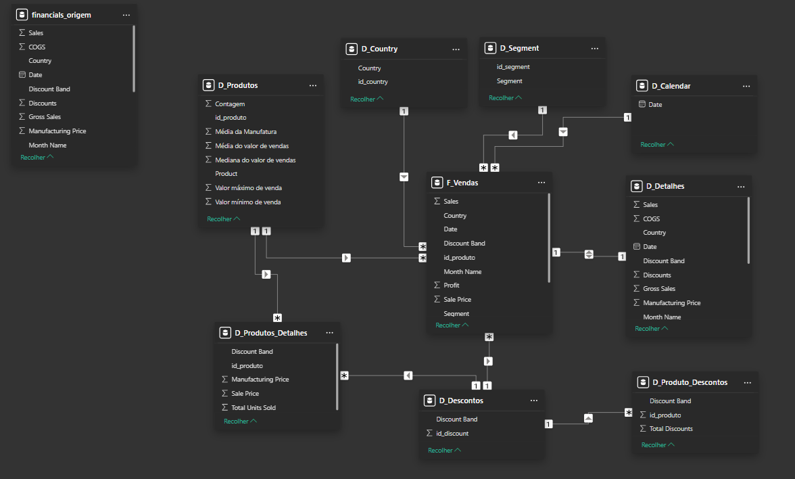

#  Modelando um Dashboard de E-commerce com Power BI Utilizando Fórmulas DAX

##  Descrição do Desafio
O objetivo deste projeto é **transformar uma tabela única** (Financial Sample) em um **modelo dimensional** baseado em **Star Schema**. A partir da tabela original, vamos construir as **tabelas fato e dimensão**, extraindo e reorganizando os dados para melhor compreensão e análise.

###  Estrutura do Modelo
1. **Tabela Original:**
   - `Financials_origem` (modo oculto – backup)

2. **Tabelas Dimensão:**
   - **D_Produtos**:  
     - ID_produto, Produto, Média de Unidades Vendidas, Média de Valor de Vendas, Mediana de Valor de Vendas, Valor Máximo de Venda, Valor Mínimo de Venda.
   - **D_Produtos_Detalhes**:  
     - ID_produto, Discount Band, Sale Price, Units Sold, Manufacturing Price.
   - **D_Descontos**:  
     - ID_produto, Discount, Discount Band.
   - **D_Detalhes** (*):  
     - Tabela que contém informações complementares que não foram contempladas nas outras dimensões.
   - **D_Calendário**:  
     - Criada via DAX com a função `CALENDAR()`.

3. **Tabela Fato:**
   - **F_Vendas**:  
     - SK_ID, ID_Produto, Produto, Units Sold, Sales Price, Discount Band, Segment, Country, Salers, Profit, Date.

---

##  Etapas do Projeto

1. **Criação das Tabelas Dimensão e Fato:**
   - Extraímos colunas específicas da tabela original para compor cada dimensão e tabela fato.
   - Utilizamos **agrupamentos** e **condicionais** para criar novas colunas derivadas.

2. **Tabela de Calendário via DAX:**
   - Geramos a **D_Calendário** utilizando a função `CALENDAR()` para garantir uma tabela de datas completa.

3. **Construção de Colunas Condicionais:**
   - Exemplo: Criamos um **Índice de Produtos** a partir de condições aplicadas sobre os dados.

4. **Reorganização das Colunas:**
   - As colunas foram reordenadas para facilitar a visualização e tornar a análise mais eficiente.

---

##  Funcionalidades e Funções DAX Utilizadas
- **Função CALENDAR()**: Para gerar a dimensão de datas.
- **Agregações**: Média, Mediana, Mínimo e Máximo.
- **Condicionais**: Criação de colunas derivadas com base em regras de negócio.

---

##  Arquivos no Repositório
- **Financials_origem**: Tabela original usada como backup (oculta).
- **Desafio_star_schema.pbix**: Arquivo Power BI com o modelo dimensional criado.
- **starschema.png**: Imagem do esquema em estrela.

---

## 🏁 Instruções para Submissão
- Salve o projeto no formato **.pbix**.
- Inclua uma **imagem** do esquema em estrela no repositório.
- **Descreva no README** o processo de construção, as funcionalidades e as funções DAX utilizadas.
- **Compartilhe o link do repositório** no GitHub para facilitar a submissão e mostrar seu trabalho para recrutadores e outros profissionais.

---

##  Finalidade do Projeto
Este projeto demonstra habilidades em:
- **Modelagem dimensional** usando Power BI.
- **Manipulação de dados com DAX** e **Power Query**.
- **Organização e documentação de projetos** para facilitar a colaboração e a visualização de recrutadores.

---

##  Tecnologias e Ferramentas Utilizadas
- 🟡 **Power BI**  
- 🧮 **DAX**  
- 🔄 **Power Query**  
